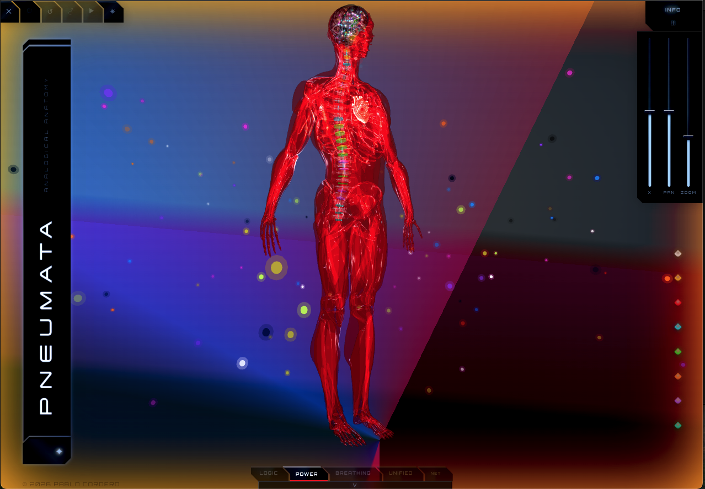
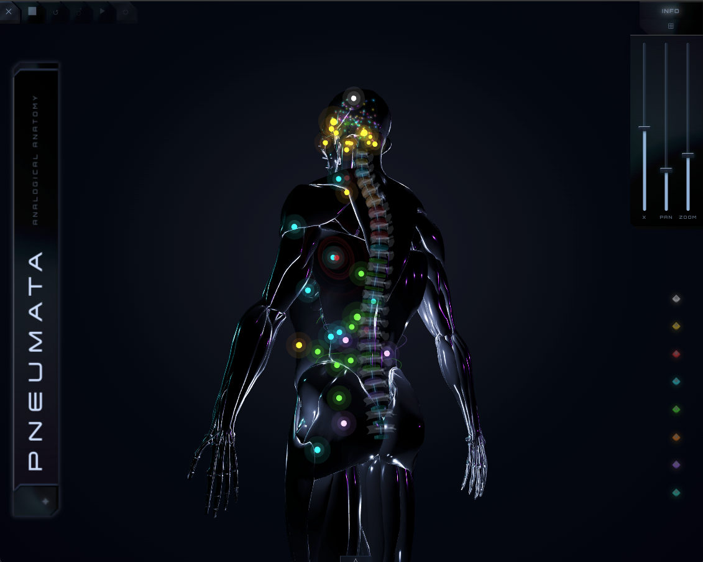
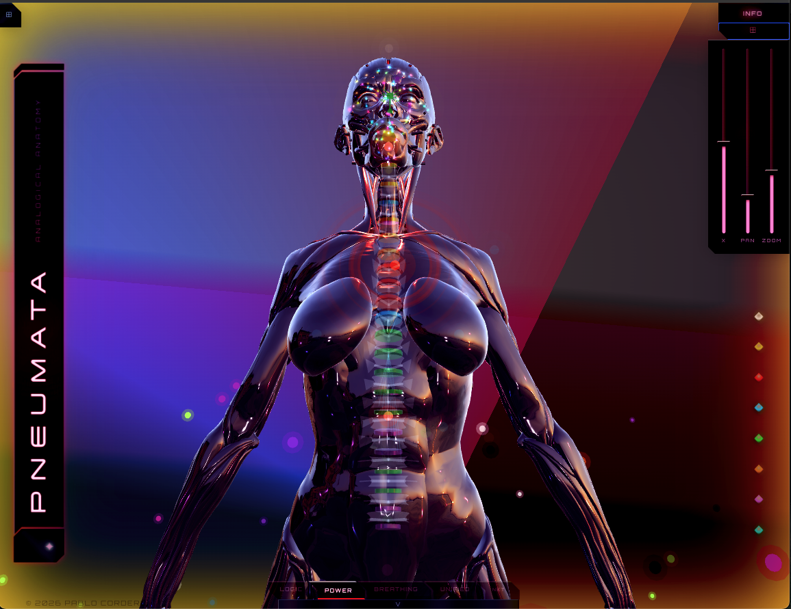
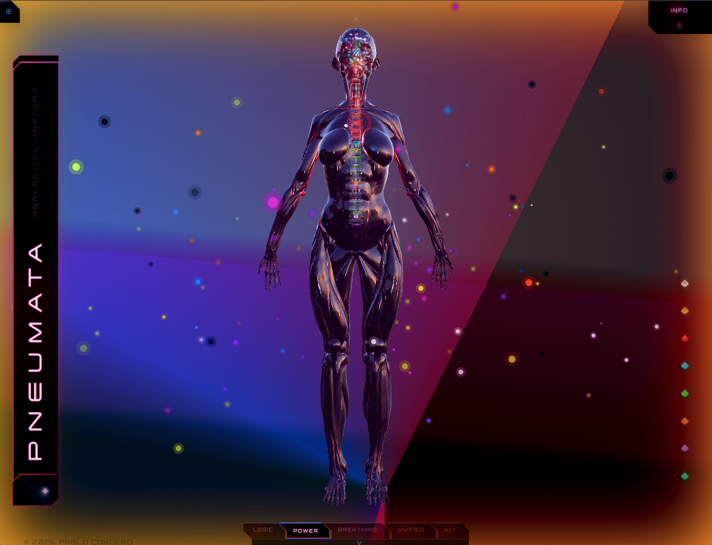
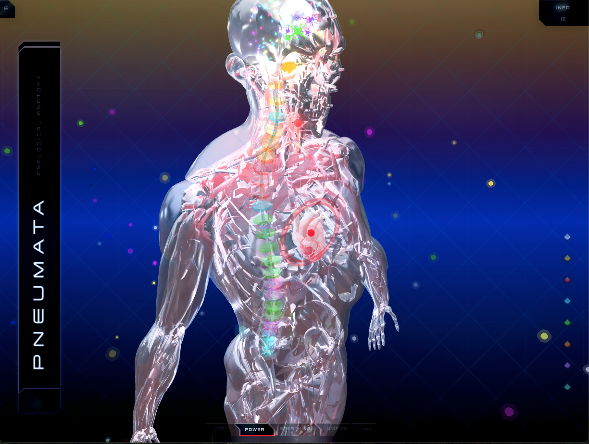
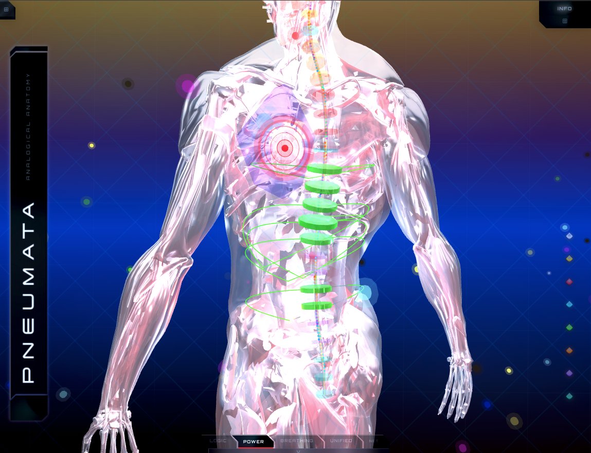
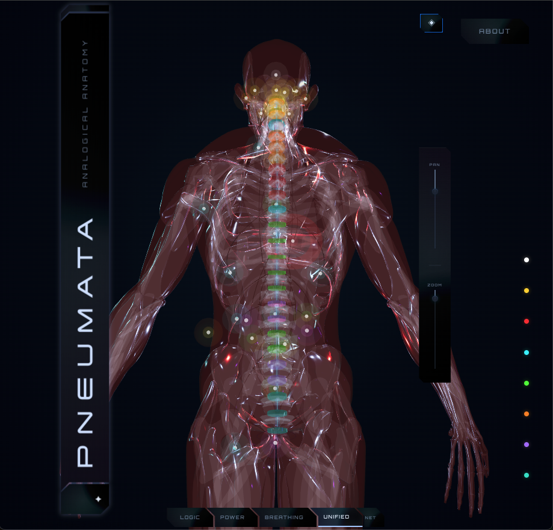
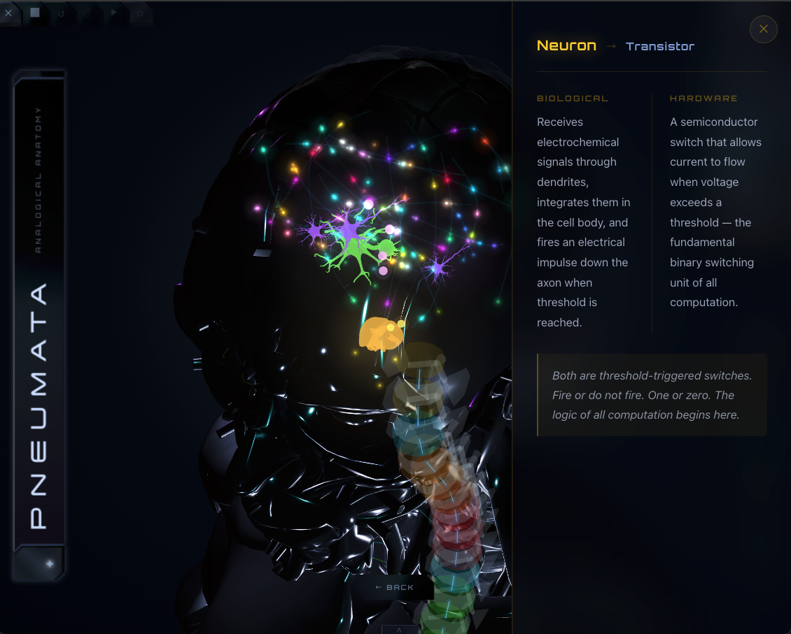
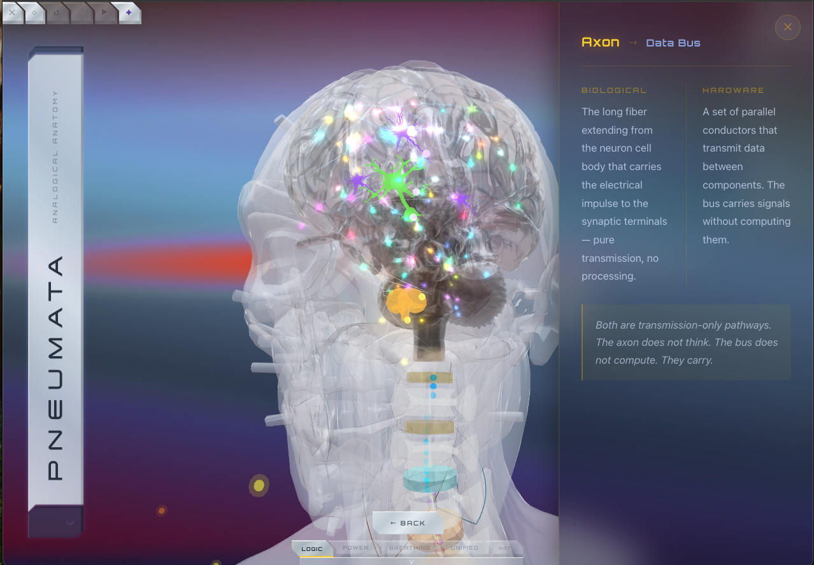
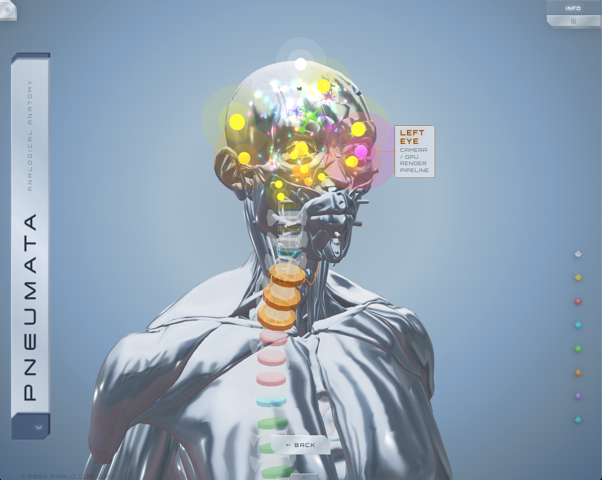

# Pneumata

**An interactive 3D anatomical model mapping every human organ to its hardware analog.**

---



| Dark mode — obsidian                                                                                       | Dark mode — female figure                                                                                         |
| ---------------------------------------------------------------------------------------------------------- | ----------------------------------------------------------------------------------------------------------------- |
|  |  |

| Female — power mode                                                                             | Back view — all systems                                                                                |
| ----------------------------------------------------------------------------------------------- | ------------------------------------------------------------------------------------------------------ |
|  |  |

| Back detail — vertebral discs                                                                        | Heart — Power Supply Unit modal                                                      |
| ---------------------------------------------------------------------------------------------------- | ------------------------------------------------------------------------------------ |
|  |  |

| Neuron vs Transistor                                                                                           | Brain zoom — Axon / Data Bus                                                                   |
| -------------------------------------------------------------------------------------------------------------- | ---------------------------------------------------------------------------------------------- |
|  |  |

| Brain zoom — cranial nodes                                                                               |     |
| -------------------------------------------------------------------------------------------------------- | --- |
|  |     |

---

## What it is

The human body and a computer are not metaphorically similar — they are architecturally isomorphic. The heart is a PSU. The spinal cord is a PCIe bus. The kidneys are a virtual memory manager. The immune system is an IDS with edge nodes, a SIEM, and a definition update engine.

Pneumata makes that argument visual and interactive. Every organ node in the model corresponds to a specific hardware component. Every spinal disc corresponds to a bus arbitration layer. The relationship is functional, not decorative — the same engineering problem solved twice, in different substrates, separated by 500 million years.

The philosophical source of truth is [`docs/analog.md`](docs/analog.md), which contains the full organ-to-hardware blueprint and closes with Federico Faggin's observation: _we did not invent the computer. We remembered it._

Pneumata also makes a claim about consciousness. A computer runs its programs whether or not anyone is watching the screen. A body does not appear to work that way — every account of it, from the inside, includes someone home. The app labels this third term "the User": the operator hardware and software exist to serve, positioned outside the wiring diagram the same way a person at a keyboard is outside the circuit board they're operating.

This tracks a real disagreement in philosophy of mind. David Chalmers named it the hard problem: physical and computational descriptions can account for function and behavior in exhaustive detail without accounting for why any of it is accompanied by felt experience. Giulio Tononi's Integrated Information Theory takes the opposite position — that consciousness is a measurable property of any sufficiently integrated system, biological or otherwise — though a 2023 open letter signed by over 100 philosophers and scientists called the theory's core claims untestable. Federico Faggin, who helped invent the microprocessor at Intel, spent his early career building the kind of information-processing systems IIT describes, then spent his later career arguing consciousness precedes them rather than emerging from them.

Pneumata sides with Faggin's later position. It is a guess, same as the alternative, but it is the guess that keeps the rest of the analogy honest: a machine, however capable, still needs an operator. The consciousness node in the model (`Pneuma`) is built around this — its hardware analog is labeled "The User."

---

## Features

- **37 organ nodes** mapped to hardware analogs across 8 categories: Logic, Power, Thermal, Digestive, Sensory, Renal, Immune, Spirit
- **Color-coded category system** — gold, red, cyan, green, amber, violet, teal, white — consistent across nodes, spine discs, and legend
- **Spinal cord auto-trace** — vertebral column geometry sampled directly from GLB mesh at runtime using vertex filtering and y-band bucketing; no hardcoded coordinates
- **24 vertebral disc markers** — color-coded by the organ system innervated at each spinal level (C2 through S2), derived from anatomical innervation data
- **Bidirectional spine-to-organ highlighting** — hovering any organ node illuminates its spinal bus lanes; hovering any disc illuminates the organ nodes it innervates
- **Clickable vertebral discs** — each disc opens a modal with its spinal level, innervation target, biological description (fibrocartilaginous cushion, foraminal spacing), and hardware analog (bus arbitration and signal isolation layer)
- **GlassModal with Bus Lane section** — clicking any node shows bio function, hardware function, synthesis, and the specific spinal channel assignment with PCIe lane analogy
- **View mode switching** — Logic (neural network), Power (circulatory grid), Breathing (pulmonary cycle), Unified (all systems)
- **Breathing mode** — body mesh color-shifts blue (deoxygenated, inhale) → cyan (oxygenated, peak) in sync with a 0.25Hz breath cycle; lung nodes flash at oxygenation moment
- **Traveling circulation orbs** — two energy nodes circuit the full body on closed loops; the heart node radiates expanding rings on each pass
- **Meridian layer (TCM channels)** — acupoint nodes and their connecting channel lines. The lines are built from the placed nodes and curve to follow the body, arcing through anatomical anchors (cervical lymph node for the neck, elbow for the arm, hip for the trunk) with rounded corners so a channel follows the limb and neck. Moving a node moves its line.
- **Meridian points as apertures** — each point renders as a hollow glowing ring in its channel's color, with a small bright center-star at the exact center used as a precision placement anchor.
- **Qi flow animation** — a toggle animates energy traveling each channel in its flow direction. As the wave reaches a point it brightens and swells, then fades with an afterglow. Source (yuan) points carry a halo that contracts inward as the wave arrives.
- **Spine reacts to qi** — the vertebral disc markers pulse in sync with the qi flowing through the organ system each disc innervates, sweeping down the spine (see `docs/medical-accuracy.md` for the mapping rationale).
- **Male and female figures** — each figure has its own meridian coordinate data adjusted for its proportions; the whole-figure scale is set per-figure in the config files.
- **Expandable category legend** — clicking a legend entry expands it to show a plain-language description, the hardware analog, and example organs; clicking outside closes it.
- **Tabbed About modal** — Philosophy tab and How to Navigate tab for first-time onboarding

---

## Anatomical Accuracy

The hardware analogy is creative interpretation. The anatomy underneath it is not.

**Spinal innervation levels** — every vertebral disc marker's organ assignment was verified against anatomical sources. Common misconceptions were explicitly corrected: the thyroid's preganglionic origin is thoracic (T1–T3 via superior cervical ganglion), not cervical; the vocal cords are innervated by CN X (vagus, brainstem origin), not the spinal cord. Full table in [`docs/medical-accuracy.md`](docs/medical-accuracy.md).

**Peripheral nerves** — spinal origins, plexus membership, and clinical correlates (carpal tunnel, sciatica, foot drop, Saturday night palsy) are all verified. Visual paths are Catmull-Rom curves through anatomical landmarks — correct structure, simplified spatial route.

**Spine geometry** — the spinal curve is auto-traced at runtime by sampling actual vertex positions from the GLB mesh. The path is not hardcoded; it follows the real cervical lordosis, thoracic kyphosis, and lumbar lordosis of the model. Vertebral bodies use a LatheGeometry barrel profile with anatomically correct flared endplates. Spinous process lengths peak at T5–T8 via a sine curve — the longest, most posteriorly angled processes in the human spine.

**Brain coordinates** — neural paths and cellular models inside the brain use coordinates derived from the real bounding box of the brain GLB at runtime (`x ±0.0706`, `y 1.558–1.723`, `z −0.1048–+0.0769`). Brains lobes are reached via the z-axis (frontal ↔ occipital), not by extending y beyond the skull.

**Neural activity** — the 198 spark particles follow paths approximating real white-matter tracts (corpus callosum, corticospinal, thalamocortical, frontal-occipital). Trail geometry represents an action potential wavefront. Current simplifications: sparks are bidirectional (real APs are unidirectional), all speeds are equal (real myelinated axons fire 70–120 m/s vs unmyelinated 0.5–2 m/s), and phase randomization doesn't model oscillatory synchrony (gamma ~40 Hz, alpha ~10 Hz). These are documented as future improvements.

---

## Tech Stack

- [Vite](https://vitejs.dev/) + [React](https://react.dev/)
- [React Three Fiber](https://docs.pmnd.rs/react-three-fiber) — React renderer for Three.js
- [@react-three/drei](https://github.com/pmndrs/drei) — helpers: `useGLTF`, `OrbitControls`, `Line`, `Html`
- [Three.js](https://threejs.org/) — 3D geometry, materials, mesh vertex sampling
- SCSS with CSS custom properties

---

## Run Locally

```bash
npm install
npm run dev
```

Opens at `http://localhost:5173`.

```bash
npm run build    # production build
npm run preview  # preview production build
```

---

&copy; 2026 Pablo Cordero. All rights reserved.
