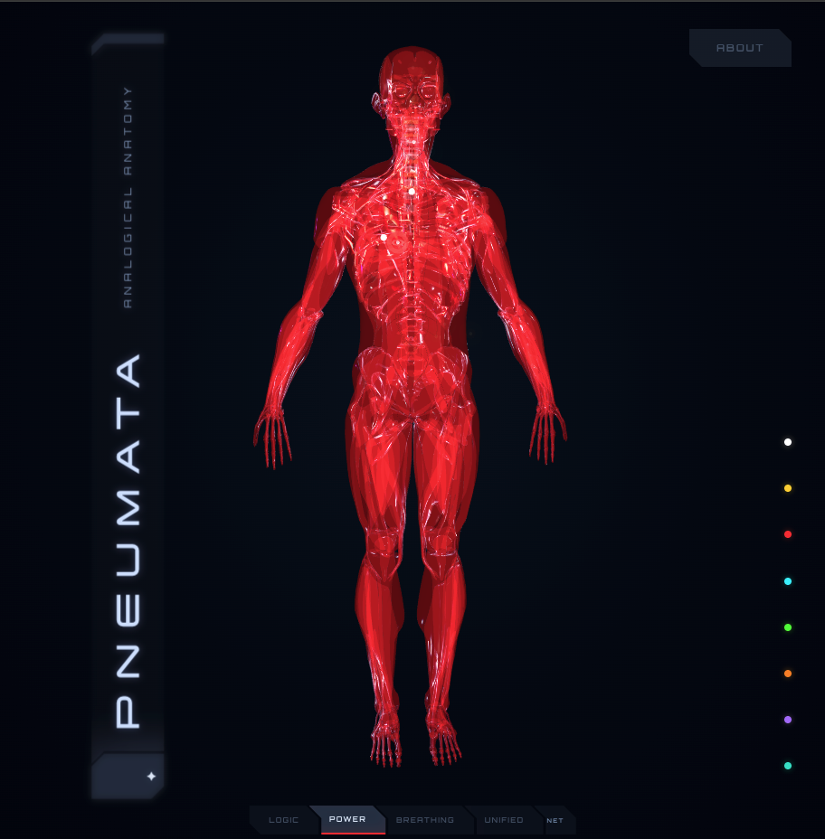
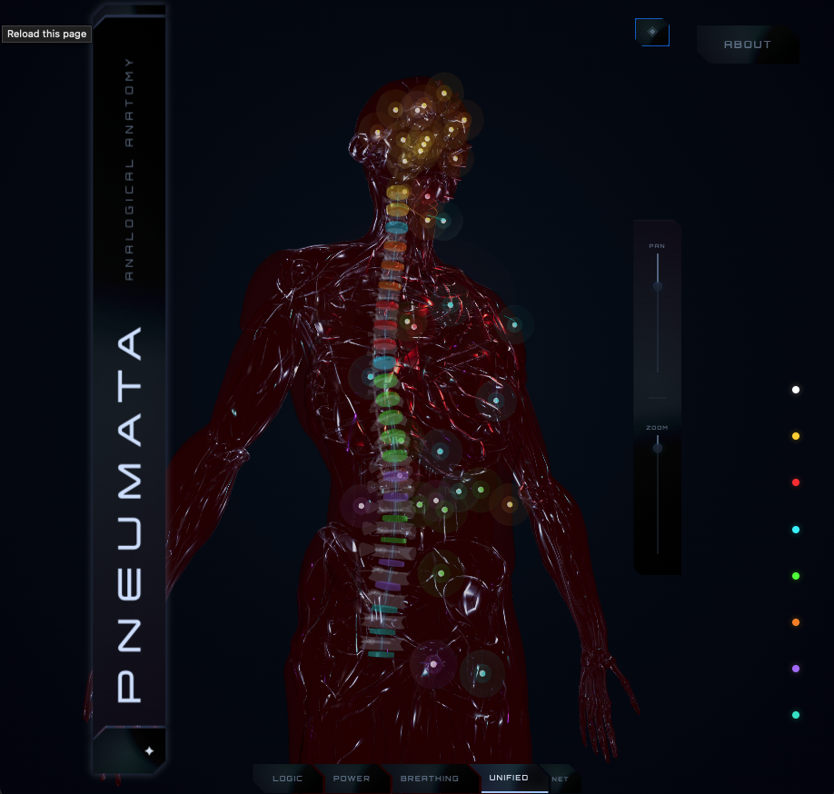
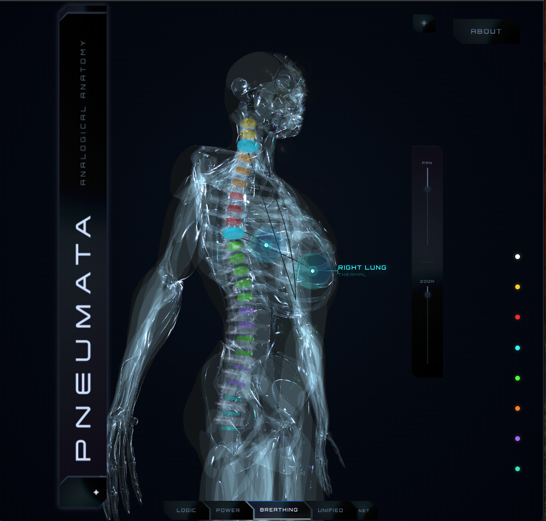
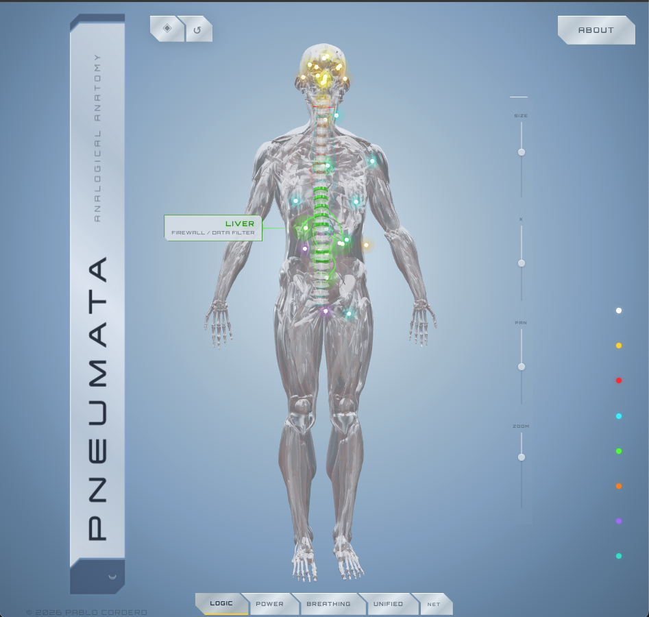
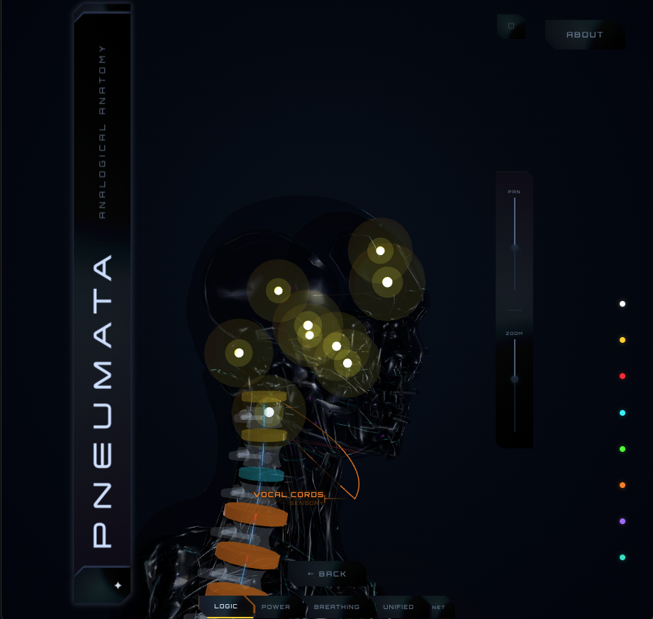
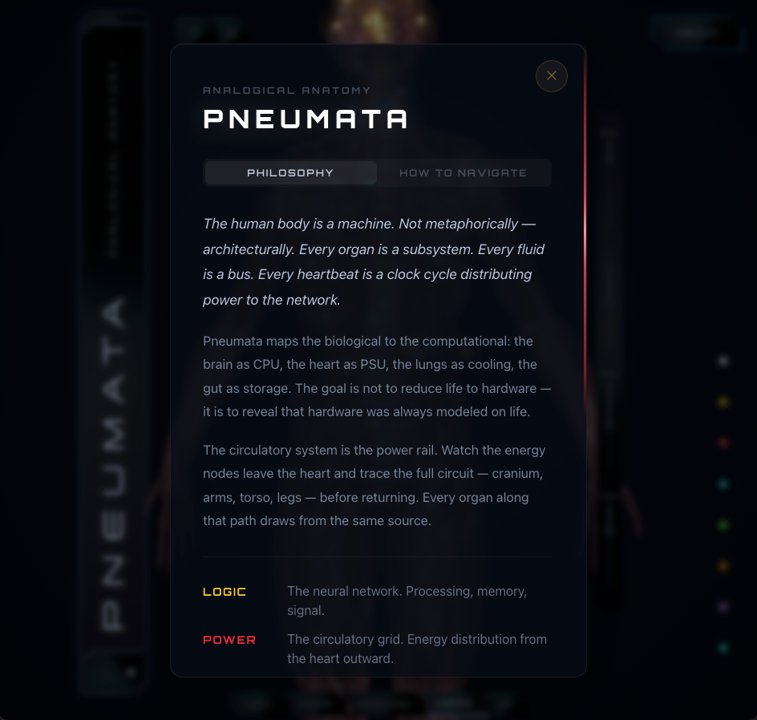

# Pneumata

**An interactive 3D anatomical model mapping every human organ to its hardware analog.**

---



| Unified — ghost mesh                                                                                                   | Breathing — inhalation                                                                                                              |
| ---------------------------------------------------------------------------------------------------------------------- | ----------------------------------------------------------------------------------------------------------------------------------- |
|  |  |

| Light mode — node hover                                                                                         | Brain zoom — Logic view                                                                                                  |
| --------------------------------------------------------------------------------------------------------------- | ------------------------------------------------------------------------------------------------------------------------ |
|  |  |

| About modal                                                                                               |     |
| --------------------------------------------------------------------------------------------------------- | --- |
|  |     |

---

## What it is

The human body and a computer are not metaphorically similar — they are architecturally isomorphic. The heart is a PSU. The spinal cord is a PCIe bus. The kidneys are a virtual memory manager. The immune system is an IDS with edge nodes, a SIEM, and a definition update engine.

Pneumata makes that argument visual and interactive. Every organ node in the model corresponds to a specific hardware component. Every spinal disc corresponds to a bus arbitration layer. The relationship is functional, not decorative — the same engineering problem solved twice, in different substrates, separated by 500 million years.

The philosophical source of truth is [`docs/analog.md`](docs/analog.md), which contains the full organ-to-hardware blueprint and closes with Federico Faggin's observation: _we did not invent the computer. We remembered it._

---

## Features

- **37 organ nodes** mapped to hardware analogs across 8 categories: Logic, Power, Thermal, Digestive, Sensory, Renal, Immune, Spirit
- **Color-coded category system** — gold, red, cyan, green, amber, violet, teal, white — consistent across nodes, spine discs, and legend
- **Spinal cord auto-trace** — vertebral column geometry sampled directly from GLB mesh at runtime using vertex filtering and y-band bucketing; no hardcoded coordinates
- **24 vertebral disc markers** — color-coded by the organ system innervated at each spinal level (C2 through S2), derived from anatomical innervation data
- **Bidirectional spine-to-organ highlighting** — hovering any organ node illuminates its spinal bus lanes; hovering any disc illuminates the organ nodes it innervates
- **Clickable vertebral discs** — each disc opens a modal with its spinal level, innervation target, biological description (fibrocartilaginous cushion, foraminal spacing), and hardware analog (bus arbitration and signal isolation layer)
- **GlassModal with Bus Lane section** — clicking any node shows bio function, hardware function, synthesis, and the specific spinal channel assignment with PCIe lane analogy
- **View mode switching** — Logic (neural network), Power (circulatory grid), Breathing (pulmonary cycle), Unified (all systems)
- **Breathing mode** — body mesh color-shifts blue (deoxygenated, inhale) → cyan (oxygenated, peak) in sync with a 0.25Hz breath cycle; lung nodes flash at oxygenation moment
- **Traveling circulation orbs** — two energy nodes circuit the full body on closed loops; the heart node radiates expanding rings on each pass
- **Tabbed About modal** — Philosophy tab and How to Navigate tab for first-time onboarding

---

## Anatomical Accuracy

The hardware analogy is creative interpretation. The anatomy underneath it is not.

**Spinal innervation levels** — every vertebral disc marker's organ assignment was verified against anatomical sources. Common misconceptions were explicitly corrected: the thyroid's preganglionic origin is thoracic (T1–T3 via superior cervical ganglion), not cervical; the vocal cords are innervated by CN X (vagus, brainstem origin), not the spinal cord. Full table in [`docs/medical-accuracy.md`](docs/medical-accuracy.md).

**Peripheral nerves** — spinal origins, plexus membership, and clinical correlates (carpal tunnel, sciatica, foot drop, Saturday night palsy) are all verified. Visual paths are Catmull-Rom curves through anatomical landmarks — correct structure, simplified spatial route.

**Spine geometry** — the spinal curve is auto-traced at runtime by sampling actual vertex positions from the GLB mesh. The path is not hardcoded; it follows the real cervical lordosis, thoracic kyphosis, and lumbar lordosis of the model. Vertebral bodies use a LatheGeometry barrel profile with anatomically correct flared endplates. Spinous process lengths peak at T5–T8 via a sine curve — the longest, most posteriorly angled processes in the human spine.

**Brain coordinates** — neural paths and cellular models inside the brain use coordinates derived from the real bounding box of the brain GLB at runtime (`x ±0.0706`, `y 1.558–1.723`, `z −0.1048–+0.0769`). Brains lobes are reached via the z-axis (frontal ↔ occipital), not by extending y beyond the skull.

**Neural activity** — the 198 spark particles follow paths approximating real white-matter tracts (corpus callosum, corticospinal, thalamocortical, frontal-occipital). Trail geometry represents an action potential wavefront. Current simplifications: sparks are bidirectional (real APs are unidirectional), all speeds are equal (real myelinated axons fire 70–120 m/s vs unmyelinated 0.5–2 m/s), and phase randomization doesn't model oscillatory synchrony (gamma ~40 Hz, alpha ~10 Hz). These are documented as future improvements.

---

## Tech Stack

- [Vite](https://vitejs.dev/) + [React](https://react.dev/)
- [React Three Fiber](https://docs.pmnd.rs/react-three-fiber) — React renderer for Three.js
- [@react-three/drei](https://github.com/pmndrs/drei) — helpers: `useGLTF`, `OrbitControls`, `Line`, `Html`
- [Three.js](https://threejs.org/) — 3D geometry, materials, mesh vertex sampling
- SCSS with CSS custom properties

---

## Run Locally

```bash
npm install
npm run dev
```

Opens at `http://localhost:5173`.

```bash
npm run build    # production build
npm run preview  # preview production build
```

---

&copy; 2026 Pablo Cordero. All rights reserved.
