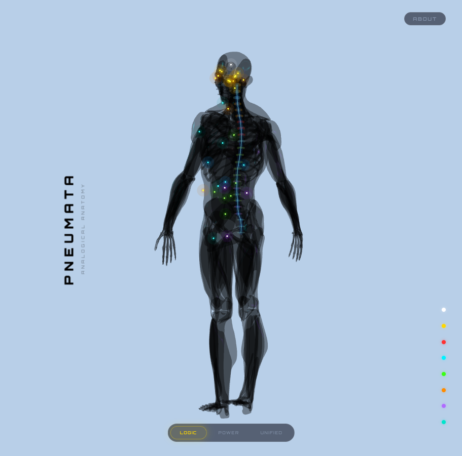
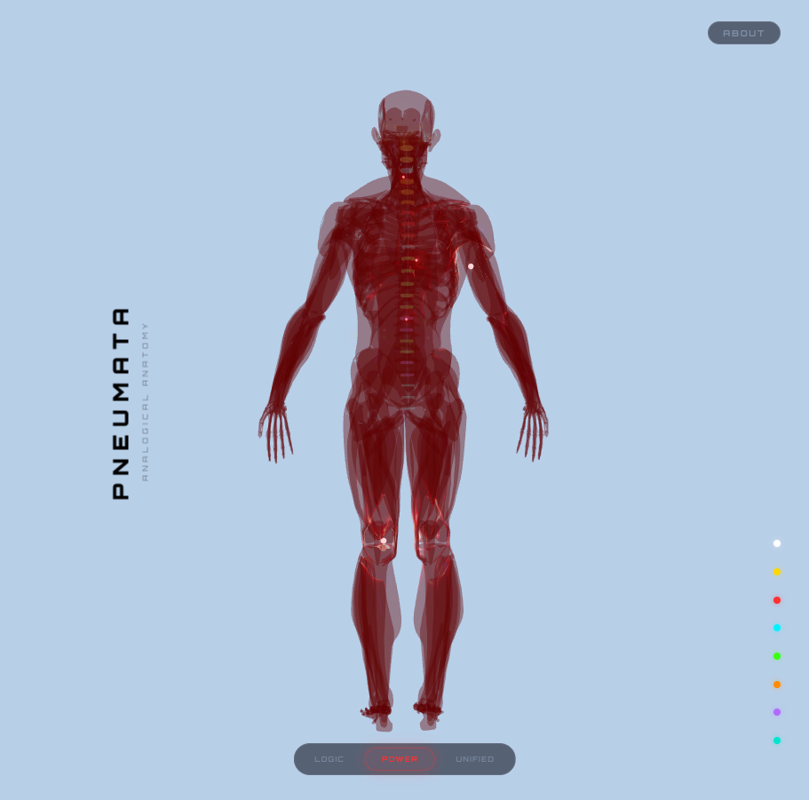
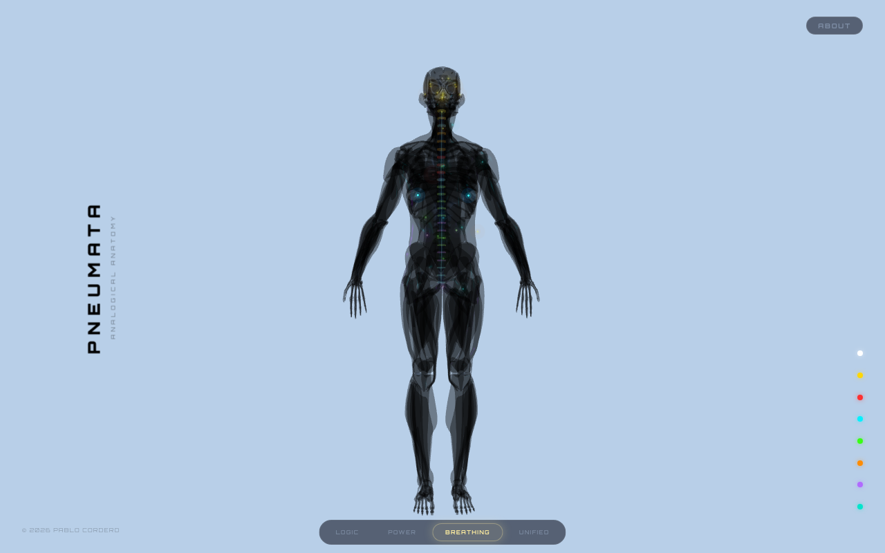
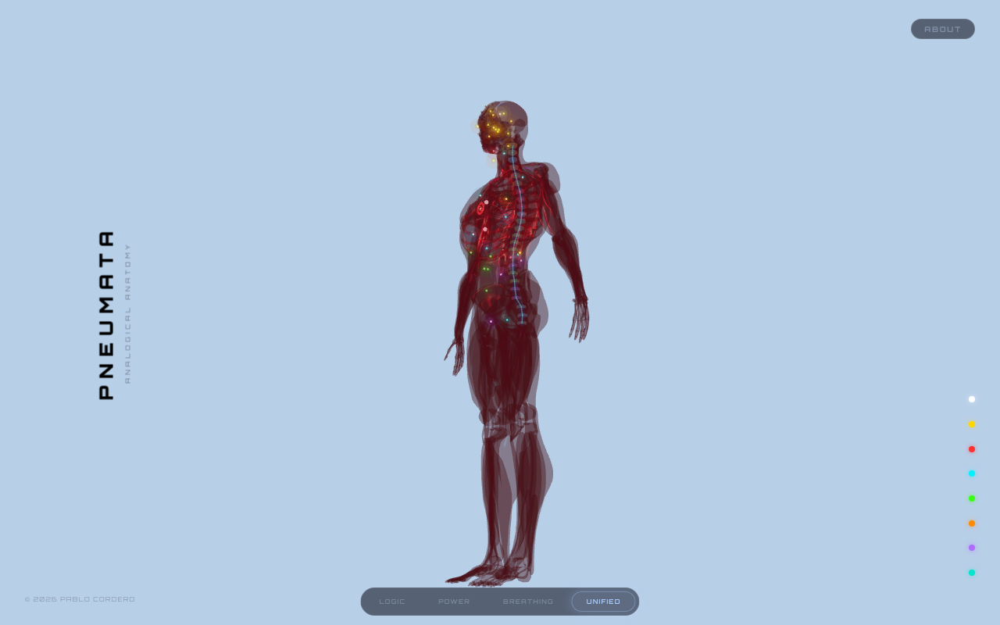
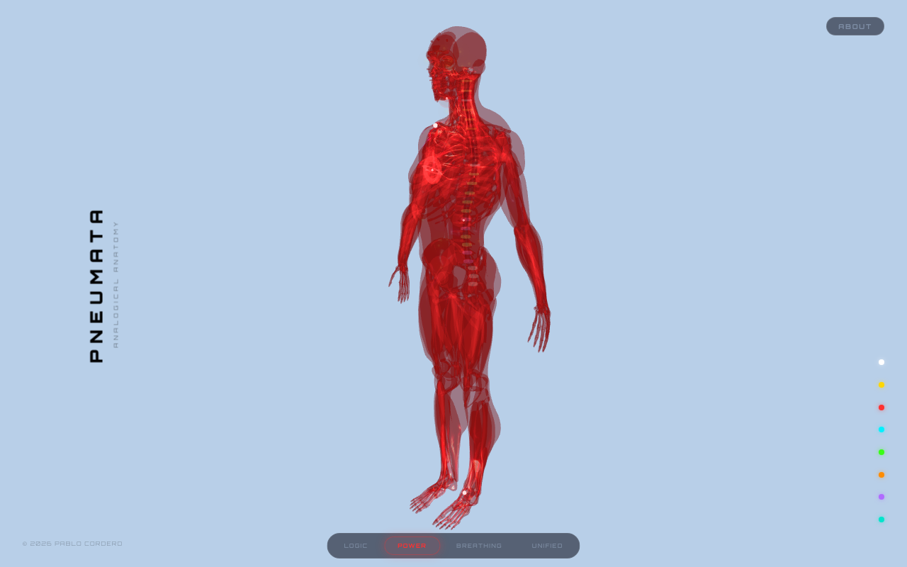
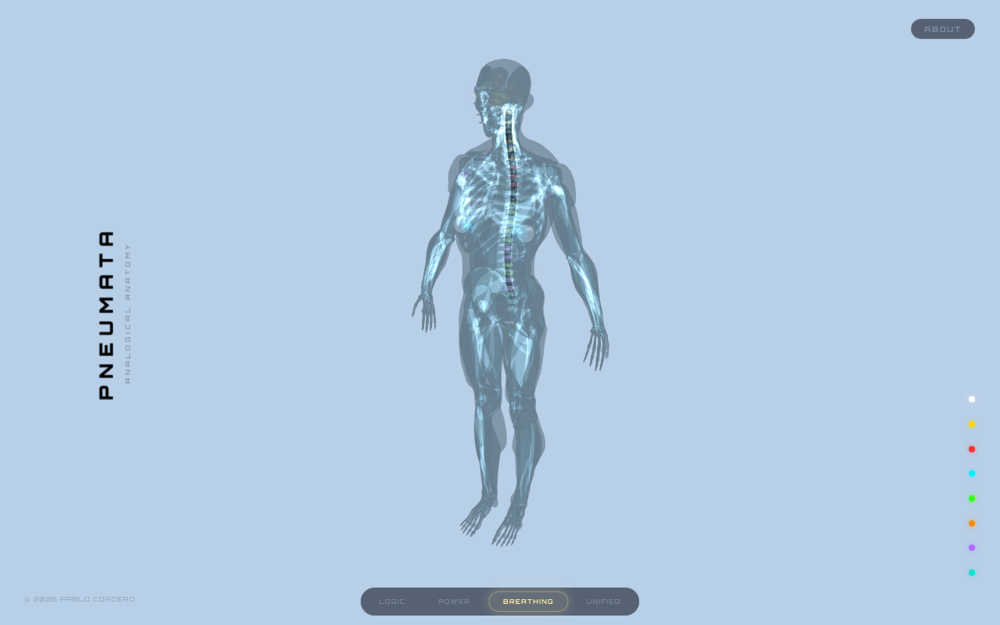
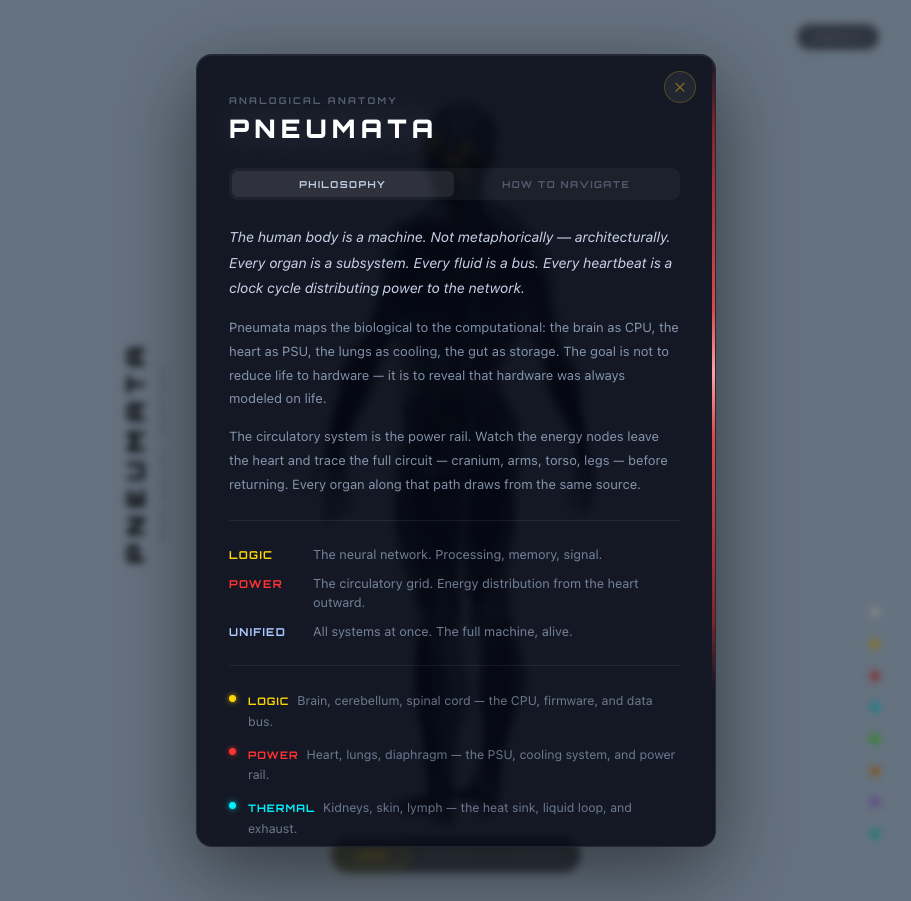

# Pneumata

**An interactive 3D anatomical model mapping every human organ to its hardware analog.**

---

| Logic mode | Power mode |
|---|---|
|  |  |

| Breathing mode | Unified mode |
|---|---|
|  |  |

| Ribcage close-up — Power mode | Chest close-up — Breathing mode |
|---|---|
|  |  |

| About modal — tabbed philosophy and navigation |  |
|---|---|
|  | |

---

## What it is

The human body and a computer are not metaphorically similar — they are architecturally isomorphic. The heart is a PSU. The spinal cord is a PCIe bus. The kidneys are a virtual memory manager. The immune system is an IDS with edge nodes, a SIEM, and a definition update engine.

Pneumata makes that argument visual and interactive. Every organ node in the model corresponds to a specific hardware component. Every spinal disc corresponds to a bus arbitration layer. The relationship is functional, not decorative — the same engineering problem solved twice, in different substrates, separated by 500 million years.

The philosophical source of truth is [`docs/analog.md`](docs/analog.md), which contains the full organ-to-hardware blueprint and closes with Federico Faggin's observation: *we did not invent the computer. We remembered it.*

---

## Features

- **37 organ nodes** mapped to hardware analogs across 8 categories: Logic, Power, Thermal, Digestive, Sensory, Renal, Immune, Spirit
- **Color-coded category system** — gold, red, cyan, green, amber, violet, teal, white — consistent across nodes, spine discs, and legend
- **Spinal cord auto-trace** — vertebral column geometry sampled directly from GLB mesh at runtime using vertex filtering and y-band bucketing; no hardcoded coordinates
- **24 vertebral disc markers** — color-coded by the organ system innervated at each spinal level (C2 through S2), derived from anatomical innervation data
- **Bidirectional spine-to-organ highlighting** — hovering any organ node illuminates its spinal bus lanes; hovering any disc illuminates the organ nodes it innervates
- **Clickable vertebral discs** — each disc opens a modal with its spinal level, innervation target, biological description (fibrocartilaginous cushion, foraminal spacing), and hardware analog (bus arbitration and signal isolation layer)
- **GlassModal with Bus Lane section** — clicking any node shows bio function, hardware function, synthesis, and the specific spinal channel assignment with PCIe lane analogy
- **View mode switching** — Logic (neural network), Power (circulatory grid), Breathing (pulmonary cycle), Unified (all systems)
- **Breathing mode** — body mesh color-shifts blue (deoxygenated, inhale) → cyan (oxygenated, peak) in sync with a 0.25Hz breath cycle; lung nodes flash at oxygenation moment
- **Traveling circulation orbs** — two energy nodes circuit the full body on closed loops; the heart node radiates expanding rings on each pass
- **Tabbed About modal** — Philosophy tab and How to Navigate tab for first-time onboarding

---

## Tech Stack

- [Vite](https://vitejs.dev/) + [React](https://react.dev/)
- [React Three Fiber](https://docs.pmnd.rs/react-three-fiber) — React renderer for Three.js
- [@react-three/drei](https://github.com/pmndrs/drei) — helpers: `useGLTF`, `OrbitControls`, `Line`, `Html`
- [Three.js](https://threejs.org/) — 3D geometry, materials, mesh vertex sampling
- SCSS with CSS custom properties

---

## Run Locally

```bash
npm install
npm run dev
```

Opens at `http://localhost:5173`.

```bash
npm run build    # production build
npm run preview  # preview production build
```

---

&copy; 2026 Pablo Cordero. All rights reserved.
